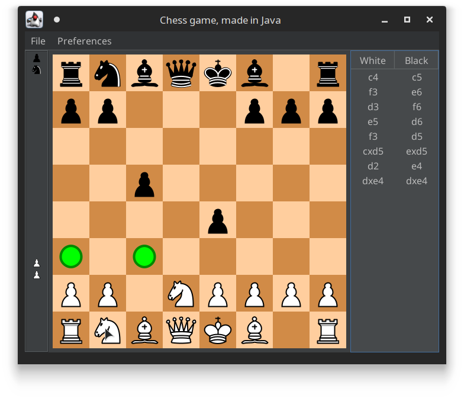

# Teal Chess

## About this project

This project is based on
[this video tutorial series](https://www.youtube.com/playlist?list=PLOJzCFLZdG4zk5d-1_ah2B4kqZSeIlWtt),
whose source code can be found on
[this repository](https://github.com/amir650/BlackWidow-Chess). This was made to
learn more about the Java language in general, and to improve a project that I
liked already.

Teal Chess has some differences with the original project, some of which are:

- The project uses Java 17 (the latest LTS version)
- Gradle is used to manage dependencies, with the Groovy DSL
- The UI looks a bit more modern, thanks to
  [FlatLaf](https://www.formdev.com/flatlaf/)
- Chess graphics are the same as the ones
  [by Cburnett on Wikipedia](https://en.wikipedia.org/wiki/User:Cburnett/GFDL_images/Chess)
- Abstractions were added when it makes sense, to increase code readability

The project is far from finished (even as a demo), which is why there's no
release yet. Any extra documentation can be found in the [docs](docs) folder.

## License

teal-chess, a port of the classic board game for Java.
Copyright (C) 2022  Víctor Mardones

This program is free software: you can redistribute it and/or modify
it under the terms of the GNU General Public License as published by
the Free Software Foundation, either version 3 of the License, or
(at your option) any later version.

This program is distributed in the hope that it will be useful,
but WITHOUT ANY WARRANTY; without even the implied warranty of
MERCHANTABILITY or FITNESS FOR A PARTICULAR PURPOSE.  See the
GNU General Public License for more details.

You should have received a copy of the GNU General Public License
along with this program.  If not, see <http://www.gnu.org/licenses/>.
